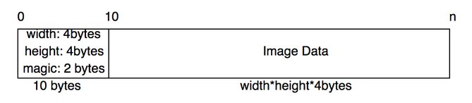

# Palette

You are tasked with writing a program that will discover and index the colour palette of an image by iterating through image data and extract the colour value. We recommend you implement this program using a linked list or some kind of data structure to contain the data.


The program will take in a filename from the command line.

```
dotnet run image
````

If no argument is specified, the program should respond with:

```
No Filename Specified
```

If the file does not exist, your program needs to respond with:

```
File Does Not Exist
```

The file format is a type of bitmap image in binary format. The top of the file will specify the width and height of the image as well as a 2 byte magic number to confirm that it is a valid type. Each 4 bytes in the image data corresponds to 1 pixel in the image.



The magic number in decimal form is: 60535


If the magic number does not match with the file specified. The program respond:
Invalid Image Header and terminate with exit code 1

If the number of pixels in the image do no match the width * height then the program should respond with:

```
Invalid Image Data
```

and terminate with exit code 1


Each 4 bytes of the image data contains (Red, Green, Blue, and 1byte of 0 Padding).
When you encounter a new pixel, you are to record it into your own 2d array of width * height.
The next time you see the same pixel value again, your program is to identify that it exists in your list and use the same index.


All image files have been included for you to test your code on. You may assume the data is little endian.

Example1 (5x5):

```
dotnet run imgd.b
```
```
[ 0, 0, 1, 1, 0 ]
[ 1, 2, 1, 1, 0 ]
[ 2, 1, 2, 1, 2 ]
[ 1, 0, 0, 0, 0 ]
[ 2, 0, 2, 1, 0 ]
```

Example2 (2x2 image):

```
dotnet run imge.b
```
```
[ 0, 0 ]
[ 1, 1 ]
```
